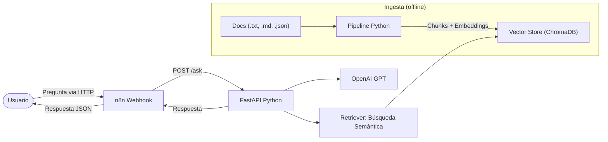

# Asistente de Soporte RAG

Sistema de soporte técnico inteligente basado en **Retrieval-Augmented Generation (RAG)** que responde preguntas de usuarios utilizando documentación técnica interna como fuente de verdad.

## Arquitectura



**Flujo completo (alto nivel):**
1. El usuario envía una pregunta vía webhook de n8n o directamente a la API
2. `/ask` genera el embedding con `sentence-transformers` (local)
3. `ChromaDB` busca los chunks más similares (`VectorStore.search`, `RETRIEVAL_TOP_K`)
4. Se arma `context_chunks` con texto + `source_file`
5. Se llama a OpenAI (`gpt-4o-mini`) para generar la respuesta
6. Se devuelve `AnswerResponse` con `answer`, `sources` (con relevancia) y `model`

## Stack Tecnológico

| Componente | Tecnología | Justificación |
|------------|-----------|---------------|
| API REST | FastAPI | Async, tipado, documentación automática OpenAPI |
| Embeddings | sentence-transformers (all-MiniLM-L6-v2) | Local, rápido, sin costo por uso |
| Vector Store | ChromaDB | Ligero, persistente, búsqueda coseno |
| LLM | OpenAI API (gpt-4o-mini) | Económico, rápido, buena calidad |
| Orquestación | n8n | Visual, extensible, webhooks nativos |
| Contenedores | Docker + Docker Compose | Reproducibilidad y despliegue simple |

## Estructura del Proyecto

```
├── src/
│   ├── api/               # API REST (FastAPI)
│   │   ├── main.py        # Endpoints: /ask, /ingest, /health
│   │   ├── schemas.py     # Modelos Pydantic (request/response)
│   │   └── metrics.py     # Observabilidad: latencias y métricas por request
│   ├── ingestion/         # Pipeline de ingesta de documentos
│   │   ├── readers.py     # Lectores por formato (TXT, MD, JSON, PDF)
│   │   ├── normalizer.py  # Limpieza y normalización de texto
│   │   ├── chunker.py     # Fragmentación semántica con overlap
│   │   ├── embedder.py    # Generación de embeddings (local)
│   │   ├── vector_store.py # Wrapper ChromaDB
│   │   └── pipeline.py    # Orquestación del flujo de ingesta
│   ├── llm/               # Integración con OpenAI
│   │   ├── generator.py   # Cliente OpenAI y generación de respuestas
│   │   └── prompts.py     # Templates de prompts (anti-alucinación)
│   ├── config.py          # Configuración centralizada
│   └── models.py          # Dataclasses compartidos (Document, Chunk)
├── docs/                  # Documentación técnica a indexar
├── tests/                 # Tests automatizados (pytest)
│   ├── conftest.py        # Fixtures compartidas
│   ├── test_normalizer.py # Tests del normalizador de texto
│   ├── test_readers.py    # Tests de los lectores por formato
│   ├── test_chunker.py    # Tests del chunker semántico
│   └── test_api.py        # Tests de integración de la API
├── n8n/
│   └── workflow.json      # Workflow exportable para n8n
├── Dockerfile
├── docker-compose.yml
├── requirements.txt
└── .env.example
```

## Requisitos Previos

- Python 3.12+
- Docker y Docker Compose
- Clave de API de OpenAI

## Instalación y Ejecución

### Opción 1: Docker Compose (recomendado)

```bash
# 1. Clonar el repositorio
git clone https://github.com/FrancoLionti/Prueba-Tecnica-Franco-Lionti.git
cd Prueba-Tecnica-Franco-Lionti

# 2. Configurar variables de entorno
cp .env.example .env
# Editar .env y agregar tu OPENAI_API_KEY

# 3. Levantar los servicios
docker compose up -d

# 4. Verificar que estén corriendo
docker compose ps
```

La API estará disponible en `http://localhost:8000` y n8n en `http://localhost:5678`.

### Opción 2: Ejecución Local

```bash
# 1. Crear y activar entorno virtual
python -m venv venv
source venv/bin/activate

# 2. Instalar dependencias
pip install -r requirements.txt

# 3. Configurar variables de entorno
cp .env.example .env
# Editar .env y agregar tu OPENAI_API_KEY

# 4. Ejecutar el pipeline de ingesta (indexa la documentación)
python -m src.ingestion.pipeline

# 5. Iniciar la API
uvicorn src.api.main:app --host 0.0.0.0 --port 8000
```

## Uso de la API

### Hacer una pregunta

```bash
curl -X POST http://localhost:8000/ask \
  -H "Content-Type: application/json" \
  -d '{"question": "Error de conexión a base de datos"}'
```

**Respuesta:**
```json
{
  "answer": "Para solucionar el error de conexión a la base de datos, sigue estos pasos:\n\n1. Verifica que el servidor de base de datos esté activo.\n2. Valida los parámetros de conexión: host, puerto, nombre de base de datos, usuario y contraseña.\n3. Confirma la conectividad de red.\n4. Revisa si el puerto de conexión está habilitado.\n5. Si el problema persiste, escala al administrador de base de datos.\n\nEsta información fue extraída de la documentación disponible (fuente: docs/Documentación 4.json).",
  "sources": [
    {
      "text": "3.2 Error: no se puede conectar con la base de datos\nMensaje mostrado\n\nError de conexión con el servidor de datos.\n\nCausas posibles\nServidor de base de datos apagado.\nParámetros de conexión incorrectos.\nPuerto bloqueado.\nCredenciales inválidas.\nProblemas de red interna.\nSolución\n\nRevisar la conexión de red, validar los parámetros de configuración y confirmar que el servicio de base de datos esté activo.\n\n3.3 Error: código de material duplicado\nMensaje mostrado",
      "source_file": "docs/Documentación 2.txt",
      "relevance": 0.7023
    },
    {
      "text": "...Error de conexión con el servidor de datos. Causas posibles:\n- Servidor de base de datos apagado\n- Parámetros de conexión incorrectos\n- Puerto bloqueado\n- Credenciales inválidas\n- Problemas de red interna\nSolución:\n- Verificar que el servidor de base de datos esté activo\n- Validar host, puerto, nombre de base de datos, usuario y contraseña\n- Confirmar conectividad de red\n- Revisar si el puerto de conexión está habilitado\n- Escalar al administrador de base de datos si el problema persiste\nNivel de soporte: Nivel 2\nPalabras clave: base de datos, conexión, servidor, puerto, PostgreSQL, credenciales",
      "source_file": "docs/Documentación 4.json",
      "relevance": 0.6992
    },
    {
      "text": "...MineCatalog\n\nMódulo: errores_frecuentes ID: ERR-DB-001\nCategoría: configuracion_servicios\nTítulo: No se puede conectar con la base de datos\nMensaje al usuario: Error de conexión con el servidor de datos.",
      "source_file": "docs/Documentación 4.json",
      "relevance": 0.5476
    }
  ],
  "model": "gpt-4o-mini",
  "metrics": {
    "embedding_latency_ms": 13.58,
    "retrieval_latency_ms": 4.50,
    "llm_latency_ms": 2028.27,
    "total_latency_ms": 2046.35,
    "question_chars": 56,
    "context_chars": 1275,
    "answer_chars": 525,
    "chunks_retrieved": 3,
    "top_relevance": 0.7023,
    "prompt_tokens": 632,
    "completion_tokens": 126,
    "total_tokens": 758
  }
}
```

### Re-indexar documentación

```bash
curl -X POST http://localhost:8000/ingest
```

### Health check

```bash
curl http://localhost:8000/health
```

### Vía n8n (webhook)

```bash
curl -X POST http://localhost:5678/webhook/ask \
  -H "Content-Type: application/json" \
  -d '{"question": "Error de conexión a base de datos"}'
```

## Configuración del Workflow n8n

1. Acceder a n8n en `http://localhost:5678`
2. Crear cuenta de administrador (primera vez)
3. Importar el workflow desde `n8n/workflow.json`
4. Publicar/activar el workflow
5. El webhook queda disponible en `/webhook/ask`

## Documentación Soportada

El sistema soporta los siguientes formatos de documentación:

| Formato | Reader | Notas |
|---------|--------|-------|
| `.txt`  | TxtReader | Extrae secciones numeradas como metadata |
| `.md`   | MarkdownReader | Extrae títulos H1 y palabras clave |
| `.json` | JsonReader | Convierte estructura JSON a texto legible |
| `.pdf`  | PdfReader | Extrae texto con PyMuPDF (bonus) |

## Testing

El proyecto incluye tests automatizados con `pytest` que validan los componentes sin consumir tokens de OpenAI (usando mocks).

```bash
# Ejecutar todos los tests
pytest tests/ -v

# Ejecutar un módulo específico
pytest tests/test_normalizer.py -v

# Ejecutar con reporte de cobertura (requiere pytest-cov)
pytest tests/ --cov=src --cov-report=term-missing
```

| Módulo de test | Qué valida |
|----------------|------------|
| `test_normalizer.py` | Limpieza unicode, colapso de whitespace, line endings |
| `test_readers.py` | Lectura de .txt, .md, .json, metadata, factory |
| `test_chunker.py` | Tamaño de chunks, overlap, metadata, edge cases |
| `test_api.py` | Endpoints /health, /ask, /ingest con mocks |

## Observabilidad

Cada request a `/ask` incluye métricas de telemetría en el campo `metrics` de la respuesta:

| Métrica | Qué mide |
|---------|----------|
| `embedding_latency_ms` | Tiempo de generar el embedding de la pregunta |
| `retrieval_latency_ms` | Tiempo de búsqueda en ChromaDB |
| `llm_latency_ms` | Tiempo de llamada a OpenAI |
| `total_latency_ms` | Suma de las tres etapas |
| `question_chars` / `context_chars` / `answer_chars` | Tamaños como proxy de tokens |
| `chunks_retrieved` / `top_relevance` | Estadísticas de retrieval |
| `prompt_tokens` / `completion_tokens` / `total_tokens` | Uso real de tokens (OpenAI) |

Estas métricas se emiten también como logs estructurados JSON, compatibles con plataformas de observabilidad (Langfuse, Datadog, ELK).

## Decisiones de Diseño

### Embeddings locales vs OpenAI
Se usa `sentence-transformers` (all-MiniLM-L6-v2) para embeddings en lugar de la API de OpenAI. Esto permite:
- Cero costo por embedding generado
- Sin dependencia de red para la indexación
- Latencia mínima en búsquedas

El requisito de usar OpenAI API se cumple en la generación de respuestas (gpt-4o-mini).

### Chunking semántico con overlap
Los documentos se fragmentan en chunks de ~500 caracteres con 50 caracteres de overlap entre chunks consecutivos. Esto evita perder contexto en los bordes de cada fragmento.

### Prompt anti-alucinación
El system prompt instruye al LLM a responder exclusivamente con información del contexto proporcionado. Si no encuentra información relevante, responde explícitamente que no la encontró en lugar de inventar una respuesta.
